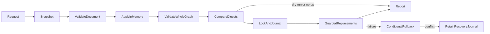

# Apply an approved agent edit document

**Status:** Approved implementation contract (requested September 12, 2026).
**Domain:** Scaffolding / local manifest authoring. **Change schema:** 1.

## Public contract

`AgentEditRequest` contains `projectPath`, `changesFile`, optional `dryRun`, and
optional `expectedDigest`. `IFxCoreClient.applyAgentEdits(request, options?)`
returns the [shared report](import-agent-package.md#report) through
`Result<AgentMigrationReport, FxError>`. `options.signal` is cooperative cancellation.
The CLI is `atk edit agent --folder <project> --changes <json> [--dry-run]
[--expected-digest <sha256>] [--format json] [-i false]`.

The edit document has exactly `schemaVersion: 1`, `agentId: string`, and
`operations: AgentEditOperation[]`. The ID is the container's logical agent ID,
not a deployment ID. An empty operation array is a valid no-op.
Unknown version, operation, field, or agent fails before writing.

| Operation kind | Exact fields beyond `kind` | Semantics |
|---|---|---|
| `replaceInstructions` | `sourceFile` | Replace with exact UTF-8 local text through the supported raw file reference |
| `setAppMetadata` | `value` | Assign supplied `name`, `description`, `developer`, `version`, `accentColor`, `validDomains`; no other top-level fields |
| `setAgentMetadata` | `value` | Assign supplied `name`, `description`, `disclaimer`, `sensitivity_label` |
| `replaceConversationStarters` | `value` | Exact array replacement, validated against the selected DA schema |
| `upsertCapability` | `value` | Complete replacement by capability `name`, retaining all other capabilities |
| `removeCapability` | `name` | Explicit removal by name; absent capability is a no-op |
| `setBehaviorOverrides` | `value` | Complete `behavior_overrides` object replacement |
| `setSchemaVersion` | `value` | Explicit bundled DA version; update its canonical schema URL and validate the entire final result |
| `replaceIcon` | `icon`, `sourceFile` | `icon` is `color` or `outline`; replace the current referenced icon bytes |
| `attachEmbeddedKnowledge` | `files` | Explicit array of `{sourceFile,targetPath}`; target is beneath `appPackage/knowledge`, relative paths retained, no flattening |

Value schemas are the selected bundled Microsoft manifest schemas, not a new
permissive parallel manifest language. Identity, credentials, arbitrary paths,
and executable hooks are never editable. Existing action/auth/skill APIs remain
the integration-creation surface. Existing global JSON merger semantics do not
change. Omitted metadata fields, including members of `name`, `description`, and
`developer`, remain unchanged. Supplied arrays replace exactly; capabilities and
behavior overrides use the complete replacement semantics above. There is no
generic recursive merge language or arbitrary property-path operation.
Empty arrays and nulls are accepted only when the selected schema permits them.

All source paths resolve against the change file directory, not CWD. Relative
slash and backslash forms are portable; traversal/absolute paths, links, and
unsafe file names fail. Attachment targets are collision checked case-insensitively
against all existing files, including unreferenced files. Existing equal bytes
at the same exact target are idempotent; different bytes cannot be overwritten
by attachment. Explicit icon/instruction replacement can update only the
selected managed resource. Knowledge remains subject to schema/service-specific
file count/type/size limits; there is never silent truncation.

## Transaction and recovery

Read a bounded safe snapshot of project files, excluding generated
`appPackage/build`, `.git`, `node_modules`, and the operation's lock/journal.
The sorted name/byte digest covers all remaining files, including environment
configuration. No env file or deployment identity is changed.

An optional expected digest is a strict initial precondition, including for
no-op/dry-run. Independently, re-read the snapshot before commit and reject any
concurrent change. Acquire the native project lock, prepare replacement files
and original-byte backups in a sibling transaction directory, and persist a
journal before the first replacement. Replace individual files atomically;
the set of replacements is **not** one OS-atomic transaction.

Before each replacement compare the current bytes with the analyzed bytes.
On ordinary failure restore only files still containing this operation's bytes.
Never overwrite an independent concurrent modification during rollback. On
unsafe/incomplete recovery retain the journal/backups and return
`AgentMigrationRecoveryRequired`; a subsequent edit refuses to proceed until
the retained transaction has been inspected and recovered. Ordinary rollback
and cancellation remove only owned temporary artifacts.

No-op does not rewrite files or provenance. Dry run performs whole-result
validation without changing project files. Removal never deletes newly
unreferenced user files; it reports their presence/packaging implications.

## Acceptance Criteria

| ID | Runtime | Purpose | Gate | Harness | Given / when | Then |
|---|---|---|---|---|---|---|
| EDT-01 | L1 | operation-integration | required | Real imported project | Approved document exercises each operation | Exact requested final values; unrelated metadata/capabilities/identity/env unchanged |
| EDT-02 | L1 | operation-integration | required | Schema/JSON harness | Unknown version/op/field/agent; forbidden identity; invalid final schema | Named error before any writes |
| EDT-03 | L1 | compatibility | required | Shared resolver + real files | Instruction/icon replacement and explicit nested knowledge attachment | Effective instructions and hashes match approval; no candidate inference or flattening |
| EDT-04 | L1 | operation-integration | required | TempDirRuntime | Reapply, empty operations, dry run, pinned stale digest | True no-op preserves bytes/mtimes; dry run preserves project; stale fails |
| EDT-05 | L1 | operation-integration | required | Real files + injected I/O seam | Concurrent change before/during commit | Conflict; no independent content overwritten |
| EDT-06 | L1 | operation-integration | required | Real transaction + fault injection | Mid-commit I/O failure/cancellation, successful rollback, unsafe rollback | Original restored when safe; recovery-required journal retained otherwise |
| EDT-07 | L1 | operation-integration | required | Existing non-import project | Already-bound app/env with no provenance | Identity preserved, template null, cloud readiness not evaluated |
| EDT-08 | L1 | operation-integration | required | Portable paths + bounded inputs | Relative edit assets, links/traversal/limits/collisions, >10 explicit knowledge files | Correct resolution or explicit rejection, never partial/truncated updates |

## Flow

## Boundary

In addition to [import boundaries](import-agent-package.md#boundary), no arbitrary
file patching, file deletion, source execution, action/auth creation, or clearing
an existing project's cloud identity. Quality advice is not an edit.

## Invariants

Only approved operations modify behavior. All operations validate as a batch
before commit. Source/edit files stay unchanged. Success never describes a
partial commit. Stale bases never silently replay; rollback never clobbers
another writer. Error names include `AgentEditsInvalid`,
`AgentEditsAgentNotFound`, `AgentEditsStale`, `AgentEditsConflict`,
`AgentMigrationIoError`, `AgentMigrationRecoveryRequired`, and `UserCancelError`.
