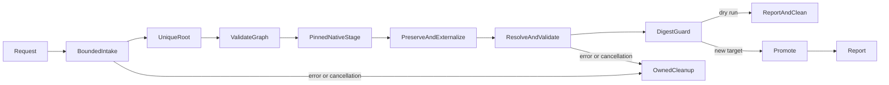

# Import a local declarative-agent package

**Status:** Approved implementation contract (requested September 12, 2026).
**Domain:** Scaffolding. **Rule catalog:** `agent-package/1`.

The approved workflow is a one-way graduation from an exported package to a new
Toolkit project. It does not change the product's runtime or introduce a new UI.
The [scenario](../../scenarios/agent-package/import-and-edit.md) records the
approved command-line workflow. No additional product-design exploration is
needed for this implementation.

## Public contract

`AgentImportRequest` in `@microsoft/teamsfx-api` has `sourcePath: string`,
`outputPath?: string`, and `dryRun?: boolean`. `IFxCoreClient` and `FxCoreClient`
in `@microsoft/teamsfx-core` expose
`importAgentPackage(request, options?: FxCoreExecutionOptions)`, returning
`Promise<Result<AgentMigrationReport, FxError>>`. Options include `signal`.
The operation never calls the host UI, token providers, or lifecycle execution.

Paths are resolved against the caller's CWD without changing CWD. Omitted output
means `<source-basename>-imported` in CWD. A folder named `appPackage` uses its
parent basename. An unsafe derived filename requires an explicit output. An
explicit output is an exact new directory, not a parent directory.

The command is `atk import agent --source <path> [--output <path>]
[--dry-run] [--format json] [-i false]`. JSON stdout is exactly one envelope:
`{ "success": true, "result": report }` or
`{ "success": false, "error": { "source", "name", "message" } }`.
Exit codes are 0 for success, 1 for failure, and 130 for cancellation.

### Report

`AgentMigrationReport` is also the report for
[batch edits](apply-agent-edits.md). Its public API declaration is the
authoritative field/type list; `agentMigrationReportSchema` is the exported
JSON validation schema and is checked against real operation reports:

- Version 1; absolute project path; `imported`, `edited`, `no-op`, or `dry-run`
  operation mode; `dryRun` and `changed` (whether the planned state differs).
- Source kind (`zip`, `directory`, or `project`) and SHA-256 digest; resulting
  project digest. Digests are `sha256:<lowercase hex>` and are derived from
  sorted relative names and exact bytes, not timestamps or ZIP compression.
- Identity policy (`new` for import, `preserved` for edits), logical agent ID,
  current app binding, nullable project tracking ID, source deployment IDs
  when known, and `provisionedByOperation: false`.
- Pinned template identity/version/content digest, or `null` for an existing
  project with no import provenance.
- Transformations with rule IDs, source/destination reference mapping, file
  inventory with hashes, and structured diagnostic codes/severities.
- `configuration.structurallyValid: true`; `readyToProvision` and
  `readyToPublish` are `not-evaluated`, with explicit configuration requirements.
  This is not a claim that an existing project is unprovisioned or publishable.
- `recoveryRequired: false` on success. Recovery failures are errors, not reports
  shaped like successful partial results.

Import provenance is written to `.atk/import.json`, outside `appPackage`.
Instruction text, bytes, private paths, and resource URLs are never telemetry.

## Supported dialect and reference graph

Intake accepts a real ZIP or extracted directory with a root `manifest.json`,
or one unambiguous `appPackage/manifest.json` wrapper. Both roots, zero roots,
multiple top-level agents, bots/tabs/custom engines, or unsupported schemas fail.
Versions must have a bundled schema and converter; no remote schema lookup.

The container's `copilotAgents.declarativeAgents[0].file` selects the DA, not a
guessed name. Preserve supported JSON fields, including `worker_agents`,
`sensitivity_label`, `disclaimer`, `user_overrides`, booleans, and schema-valid
null/empty forms. Only deployment identity is reset: the container `id` becomes
`${{TEAMS_APP_ID}}`; the source DA deployment `id`, when present, is provenance.
The container's logical agent ID and knowledge/connector/worker resource IDs
remain unchanged. No generic empty-value stripping or schema upgrade.

The graph follows icons, DA actions, local workers, API-plugin runtime specs and
card/tool/image files, local OpenAPI `$ref` dependencies, and localization files
relative to their owning document. Embedded-knowledge paths are relative to the
package root, matching the native package builder. Contained parent references
in dependency documents are allowed; package entry names cannot contain traversal.
Local path separators are normalized to `/` for portable output. Absolute
HTTP(S) service/resource references are classified but never downloaded.
Unresolvable local references fail. JSON/YAML dependency documents are parsed as
data, never executed. Dynamic file references and executable plugin runtimes are
unsupported. Remote OpenAPI `$ref` dependencies are retained and reported, not
used to make a false local-validation claim.

Instruction text is externalized using the shared manifest resolver's explicit
literal form `$[file('<relative .txt path>', 'raw')]`. This form preserves exact
UTF-8 text, CRLF, dollar/replacement tokens, and template-like prose; it does not
interpret file contents as another template. Existing one-argument `file()`
semantics remain unchanged. A whole-field static source file reference is
followed; otherwise the source instruction string is literal. Missing optional
instructions remain absent. File paths stay within the owning manifest folder.
The final project is resolved using the shared resolver and explicit fixture
bindings, and effective instructions must equal the source text.

Unreferenced files are inventoried but not copied into active assets. Potential
knowledge documents are reported as candidates without a count cap or inferred
capability. They cannot overwrite instructions, even with colliding basenames.
Explicit attachments belong to batch edits.

### Intake limits (catalog version 1)

The existing local package builder caps compressed packages at 10 MiB. This
operation uses the same compressed bound and adds conservative local-processing
bounds; these are import safety limits, not claimed service limits.

| Bound | Limit |
|---|---:|
| ZIP bytes | 10 MiB |
| Actual expanded bytes (or directory bytes) | 64 MiB |
| Bytes per file | 10 MiB |
| Files and directory entries | 2,048 |
| Relative path length | 240 characters |
| Path depth | 16 components |
| Edit-document bytes | 1 MiB |

ZIP metadata is parsed by the native ZIP dependency, inflation is bounded, and
actual length and CRC are verified. Reject encryption, unsupported compression,
links/special files, malformed UTF-8 names/content, duplicate/case/Unicode-normalized
names, drive/UNC/absolute paths, dot traversal, Windows devices/ADS/trailing-dot
names, and file/directory prefix collisions. Directory intake enforces the same
names/byte/count rules and refuses symlinks, reparse links, and hard-linked files.

## Generation and persistence

Use the immutable `declarative-agent-basic` native template profile at version
`6.16.0`, native renderer, and native tracking-ID support, never remote/latest
template selection. The migration-only archive and content-digest metadata live
under `fx-core/resource/agent-import/6.16.0/`. The archive is distributed as
canonical `template.zip.b64` text so package-manager patches cannot corrupt
binary data. Runtime import strictly decodes base64, checks `archiveSha256`
before opening the ZIP, then verifies the decoded entry-content digest.
Runtime import verifies this profile
and never reads or updates ordinary creation's `common.zip` or template-channel
metadata. Refreshing the profile is an explicit versioned maintenance action,
not a side effect of updating the normal template bundle.
Import does not run new-agent sensitivity-label enrichment or TDP identity
postprocessing. Template assets are shipped in the native package. Source
metadata overlays the scaffold; original assets retain their bytes and paths.
Lifecycle files come only from the trusted native template and are not executed.
The ordinary package builder recognizes import provenance and retains the complete
validated graph, including local workers and transitive action assets. Imported
plugin card-file references are preserved instead of applying new-agent
postprocessing. Authoring instructions are resolved through the shared resolver.

Analysis and staging occur beside the target on the same filesystem. A complete
validated directory is promoted with a rename. Destination checks and a sibling
operation lock protect cooperating invocations; an existing target always fails.
No overwrite, force, merge, direct-write fallback, or source mutation is allowed.
Dry run validates the same staged result, removes staging, and creates no target.
Missing output-parent directories are tracked and removed after preview/failure;
only successful import retains them.
Cancellation is checked during intake, graph work, generation, and before commit.

## Errors

User errors: `AgentPackageSourceInvalid`, `AgentPackageUnsupported`,
`AgentPackageLimitExceeded`, `AgentPackagePathInvalid`, `AgentPackageCollision`,
`AgentPackageReferenceMissing`, `AgentPackageSchemaInvalid`,
`AgentPackageIntegrityInvalid`, `AgentPackageDestinationExists`.
Infrastructure errors: `AgentMigrationIoError`, `AgentMigrationRecoveryRequired`.
Cancellation uses the existing `UserCancelError`. All errors are localized and
survive the public Result and CLI boundaries.

## Acceptance Criteria

| ID | Runtime | Purpose | Gate | Harness | Given / when | Then |
|---|---|---|---|---|---|---|
| IMP-01 | L1 | operation-integration | required | TempDirRuntime + real ZIP | Root/wrapped ZIP or directory is imported | Unique container pointer selects a complete native project; source bytes unchanged |
| IMP-02 | L1 | compatibility | required | Shared resolver + native package builder | Inline or referenced Unicode/CRLF/template-like instructions; later file edit | Initial effective text is identical; later edit changes packaged instructions |
| IMP-03 | L1 | compatibility | required | Schema + normalized JSON diff | Supported modern fields, scoped/unscoped and schema-valid empty/null values | Values and logical/resource IDs survive; only documented deployment fields change |
| IMP-04 | L1 | operation-integration | required | Real nested fixture graph | Numbered/nested DA, actions/OpenAPI refs/cards/localization/knowledge/workers | Full local closure and icon/image hashes preserved; remote resources not fetched |
| IMP-05 | L1 | operation-integration | required | TempDirRuntime | More than ten candidates, repeated basenames, `instruction.txt` | Complete inventory; no automatic knowledge or collisions |
| IMP-06 | L1 | operation-integration | required | Real malformed archives/directories | Invalid roots/JSON/UTF-8/schema/missing references | Named errors, no target and no source mutation |
| IMP-07 | L1 | operation-integration | required | Bounded ZIP + directory | Byte/count/depth limits, corrupt/encrypted/unsupported ZIPs | Explicit bounded/integrity rejection before promotion |
| IMP-08 | L1 | operation-integration | required | Real paths/archive metadata | Traversal, absolute/drive/UNC paths, links, device names, case/name/prefix collisions | Fail closed on every platform |
| IMP-09 | L1 | operation-integration | required | Native template + public client | Source deployment IDs and labels, host callbacks that fail if called | New tracking/unresolved binding; no UI/auth/network/AI/source execution/enrichment |
| IMP-10 | L1 | operation-integration | required | TempDirRuntime | Existing destination, dry run, cancellation, injected staging/promotion failure | No overwrite or partial project; only owned artifacts cleaned |
| IMP-11 | L1 | operation-integration | required | Path harness | Relative/default output, spaces/Unicode, slash/backslash references | Correct absolute output and unchanged CWD; no installed-package writes |

## Flow

## Boundary

No remote discovery/source downloads, AI, authentication, provisioning, sharing,
publishing, source hooks, custom-engine conversion, web UI integration, existing
agent takeover, automatic schema upgrades, branding replacement, instruction
rewriting, or inferred resource scopes.

## Invariants

Source bytes are immutable. The output is new and structurally complete or
absent. Unknown/unsupported input never becomes success-shaped fallback.
Knowledge identities are not deployment identities. Reports are complete and
never imply service readiness from local structural validation.
