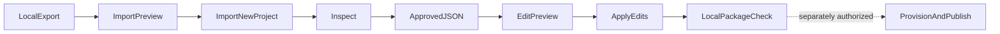

# Local package graduation and approved edits

**Status:** Approved implementation contract.
**Domain:** Scaffolding / local authoring.
**Scenario ID:** SCN-AGENT-PACKAGE.
**Workflow:** Maker export to a new native declarative-agent project, followed
by a separate checked-in edit document. No new UI or runtime is introduced.

## Composed operations

- [Import agent package](../../operations/scaffolding/import-agent-package.md)
- [Apply agent edits](../../operations/scaffolding/apply-agent-edits.md)

## Acceptance Criteria

| ID | Runtime | Purpose | Gate | Harness | Given / when | Then |
|---|---|---|---|---|---|---|
| SCN-AGENT-PACKAGE-01 | L1 | scenario | required | Public FxCoreClient + native package builder | Import a real nested package, edit approved instructions/knowledge, package using fixture IDs | Usable native lifecycle files; preserved source semantics before edits; effective approved changes afterward; source immutable |
| SCN-AGENT-PACKAGE-02 | L2 | surface | required | Real CLI process with closed stdin | Import/edit JSON success/error/dry-run/no-op/help/version/cancellation | Registered commands, single JSON envelope, correct exits, no prompt/network/auth; CLI and public API reports agree |
| SCN-AGENT-PACKAGE-03 | L1 | compatibility | required | Installed package artifacts | Public API/core/CLI assets are packed and loaded | Supported declarations/methods/template/schema assets resolve without private deep imports or repository-relative fallback |

## Flow

## Boundary

No tenant resources are created in this scenario. Explicit fixture environment
IDs are local package-validation inputs, not evidence of deployment readiness.
Provisioning/publication and any future UI integration require separate approval
and their existing lifecycle contracts.
